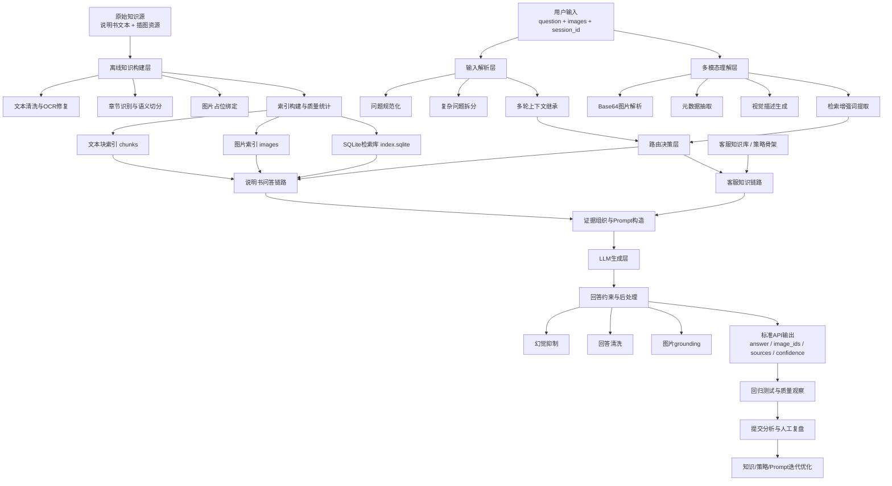
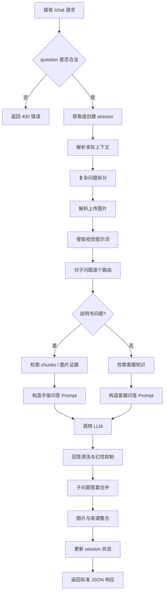

# 具有多模态能力的客服智能体设计与实现

## 摘要

面向工业产品使用咨询与电商客服融合场景，本文设计并实现了一套具有多模态理解能力的客服智能体系统。系统围绕“用户问题理解、知识库检索增强、图文协同回答、多轮对话管理、幻觉抑制”五个关键环节展开，构建了从原始说明书与插图知识到最终客服响应的完整技术链路。系统以产品说明书、配套插图和客服场景知识为基础，综合采用文本清洗、结构化切分、混合检索、多轮上下文继承、图像辅助理解和回答后处理等技术，实现了面向复杂客服问题的自动问答服务。

针对赛题中普遍存在的多模态理解不稳定、说明书数据噪声较大、复杂问题难以逐项覆盖、英文汇总手册跨产品干扰明显以及图片与答案难以精准对应等问题，本文提出了一种“规则路由 + RAG 检索 + 图像理解增强 + 回答约束生成”的工程化实现方案。当前系统已完成知识库构建、API 封装、问答服务、回归测试与提交分析脚本开发，具备可运行、可验证、可持续迭代的基础能力。实验与工程验证表明，该方案能够较好支撑说明书问答、常见客服问答、多轮追问与图文联合回答任务，为多模态客服智能体的工程落地提供了可复现的实现路径。

**关键词**：多模态客服智能体；检索增强生成；知识库构建；多轮对话；幻觉抑制

---

## 1. 作品难点与创新

### 1.1 作品难点

本赛题并非单纯的大模型问答任务，而是一个同时涉及多模态理解、知识增强、多轮对话与工程部署的综合性系统设计问题。结合赛题要求与实际开发过程，本文认为其主要技术难点集中在以下几个方面。

首先，原始知识源存在明显的非结构化与噪声问题。赛题提供的知识库以产品说明书文本和插图为主，其中既包含中文手册，也包含体量较大的英文汇总手册。原始文本中存在 OCR 粘连、符号混乱、章节格式不统一、`<PIC>` 占位符与图片编号不严格对齐等问题。如果直接将原始文本输入模型，极易导致召回噪声大、答案不准确、图片无法正确绑定等问题。因此，如何完成高质量的知识清洗与结构化切分，是系统设计的首个核心难点。

其次，用户问题具有明显的复杂性和异构性。部分问题属于说明书型技术问答，例如设备安装、指示灯含义、操作步骤、安全注意事项；部分问题属于电商客服型问答，例如发票、物流、退换货、维修、赔偿；还有相当一部分问题是多意图混合问题，甚至会同时出现多个子问题。若采用单一问答流程统一处理，容易出现路由错误、部分漏答、回答结构混乱等问题。因此，如何针对问题类型进行准确分流，并在复杂问题场景下逐项拆解、逐项作答，是第二个关键难点。

再次，多模态能力的真正难点不在“能接收图片”，而在“如何让图片理解结果有效提升检索与生成质量”。用户上传图片往往包含设备局部、指示灯状态、部件位置、接口形态、损坏现象等信息。如果图像信息只作为附属字段存在，而不能参与检索 query 构造和证据筛选，那么多模态链路对最终回答的帮助会非常有限。因此，如何将图片元数据、视觉描述和视觉关键词转化为检索增强信号，并在回答阶段尽量实现图文对应，是本系统设计中的第三个难点。

最后，客服场景对回答质量有更高要求。赛题评分不仅要求回答正确，还要求结构清晰、内容完整、语言自然、图文互补，并尽量抑制幻觉。实际开发中可以发现，大模型在缺少证据或召回不准时，容易出现泛化解释、冗长铺垫、模板化客服口吻、英文题答非所问等问题。因此，如何通过提示词约束、证据筛选、抽取式兜底、多轮上下文管理和回答清洗降低幻觉，是系统高分实现中的关键难点。

### 1.2 作品创新点

围绕上述关键难点，本文提出并实现了以下几个方面的创新性设计。

第一，构建了面向说明书问答场景的清洗与分块一体化知识库流程。系统不仅完成基础文本切分，还对 OCR 噪声修复、章节标题识别、低价值片段过滤、插图标记绑定、英文汇总手册子领域划分等环节进行了定制化处理，使原始说明书知识能够以更适合检索和生成的形式进入 RAG 流程。

第二，提出了“说明书问答 + 客服问答”双通路协同架构。系统并未将所有问题都压入同一套生成逻辑，而是通过问题路由模块区分技术型问题和平台型客服问题。对于说明书型问题，优先走手册检索增强问答；对于物流、发票、售后等场景，则调用独立的客服知识库与策略模板生成答案，从而提升回答的针对性和风格一致性。

第三，设计了“图像理解增强检索”机制。系统能够解析用户上传的 Base64 图片，提取尺寸、格式等元数据，并在视觉模型可用时生成局部视觉描述，再将其中的部件词、状态词、故障词转化为检索增强项，用于提升说明书相关 chunk 的召回能力。这种方式避免了图像输入仅作为装饰信息存在的问题，使多模态链路真正参与到问题理解与知识检索中。

第四，设计了复杂问题拆解与多轮上下文继承机制。系统通过子问题切分模块识别多问一体输入，并逐项生成中间结果后再统一合并回答；同时通过会话状态管理模块记录当前产品、型号、最近问题、最近图片等信息，实现“追问继承”“上下文清空”“话题切换识别”等多轮能力，提升复杂客服场景下的对话连贯性。

第五，针对幻觉与答非所问问题，系统引入了多层约束机制。包括问题路由前置过滤、检索证据重排序、低质量 chunk 剔除、语言一致性控制、手册型问题抽取式兜底、回答结构清洗、图片 grounding 约束等，从工程角度降低大模型在弱证据条件下的自由发挥空间，提高最终答案的可信度与稳定性。

---

## 2. 方案论证与设计

### 2.1 总体设计目标

本系统的设计目标是构建一个可部署、可测试、可持续优化的多模态客服智能体，使其满足以下要求：

1. 能够接收文本与图片输入，具备基础多模态理解能力。
2. 能够利用说明书文本与插图构建知识库，并基于知识库进行检索增强问答。
3. 能够识别物流、发票、退款、售后等通用客服问题，并给出自然、完整的客服式回答。
4. 能够支持多轮对话和复杂问题拆分，减少漏答与错答。
5. 能够以标准 RESTful API 的形式对外提供服务，满足比赛测试与复现要求。

### 2.2 方案可行性分析

从数据条件看，赛题已提供较为完整的说明书语料和插图资源，具备构建知识库的基础。虽然原始数据噪声较多，但通过预处理与结构化切分可以显著提升可用性。从模型条件看，当前开源或兼容 OpenAI 的大语言模型已经具备较强的指令遵循和长文本生成能力，适合承担最终答案生成任务。从系统结构看，采用模块化设计能够将路由、检索、图像理解、对话管理和回答生成分离，既便于快速迭代，也便于后续针对赛题得分进行定向优化。因此，基于“知识库 + RAG + 多模态理解 + 规则增强”的技术路线是可行且具有工程优势的。

### 2.3 技术路线设计

本文采用分层式技术路线，整体流程如下：

1. 对原始说明书和图片资源进行清洗、解析、切分和索引构建。
2. 将处理后的文本块、图片索引和结构化客服知识共同组成系统知识底座。
3. 对用户输入进行预处理，包括问题规范化、语言识别、复杂问题拆解和会话上下文继承。
4. 对问题进行路由判断，将问题分别送入说明书问答链路或客服问答链路。
5. 若用户上传图片，则先进行图片解析与视觉信息提取，并将图像结果作为检索增强信号。
6. 基于检索结果构造上下文提示词，调用大模型生成答案。
7. 对答案进行清洗、结构修复、图片对齐和置信度整合，最终通过 `/chat` 接口输出结果。

### 2.4 模块化方案设计

为保证系统清晰性与可维护性，本文将系统划分为五个主要模块。

**（1）知识库构建模块**

负责处理 `Knowledge_base/` 下的说明书和插图资源。该模块主要完成手册解析、OCR 清洗、章节划分、图片占位绑定、chunk 切分、索引写入与质量统计，最终生成 `manuals.json`、`chunks.jsonl`、`images.jsonl`、`index.sqlite` 等构建产物。

**（2）多模态理解模块**

负责处理用户上传图片。模块首先解析 Base64 编码，获取图片尺寸、格式等元数据；在视觉模型可用时，调用视觉模型生成简短描述；随后提取视觉关键词、部件词和状态词，用于后续检索增强。

**（3）问题理解与对话管理模块**

负责完成复杂问题拆分、多轮上下文继承、产品与型号补全、话题切换检测以及路由前置分析。该模块保证系统能够处理“多个问题合并提问”“上一轮追问”“切换产品后继续提问”等真实客服场景。

**（4）检索增强与回答生成模块**

对于说明书型问题，模块通过关键词分析、混合检索、证据过滤、上下文构造等步骤，从知识库中选出高相关证据，并驱动大模型生成 grounded answer；对于客服型问题，则从客服知识库中检索相关结构化条目，构造客服策略上下文后生成自然语言回答。

**（5）接口与验证模块**

负责对外提供统一 API，并支持健康检查、提交样例生成、固定回归测试、质量观察、提交质量分析等工程能力，为系统部署与比赛验证提供支撑。

### 2.4.1 模块职责表

为进一步明确系统模块划分与实现边界，本文对各核心模块的职责、输入输出和主要实现文件进行归纳，如表 1 所示。

| 模块名称 | 主要职责 | 关键输入 | 关键输出 | 对应实现 |
| --- | --- | --- | --- | --- |
| 知识库构建模块 | 完成说明书解析、OCR 清洗、图片绑定、chunk 切分、索引构建与质量统计 | 原始说明书文本、插图资源 | `manuals.json`、`chunks.jsonl`、`images.jsonl`、`index.sqlite`、构建摘要 | `src/industry_agent/kb/`、`scripts/build_kb.py` |
| 多模态理解模块 | 解析用户上传图片，抽取元数据、视觉描述和检索增强词 | Base64 图片、用户问题 | 图片摘要、视觉关键词、检索提示词 | `src/industry_agent/agent/image_understanding.py` |
| 问题理解与对话管理模块 | 完成复杂问题拆分、多轮上下文继承、产品补全、话题切换识别 | 当前问题、历史会话 | 子问题序列、补全后的 query、会话状态 | `context_manager.py`、`question_splitter.py`、`session_store.py` |
| 检索增强与回答生成模块 | 执行问题路由、知识检索、证据筛选、Prompt 构造与大模型生成 | 子问题、视觉提示词、知识索引 | grounded answer、参考证据、图片 ID、置信度 | `service.py`、`question_router.py`、`customer_service_kb.py`、`rag/` |
| 接口与验证模块 | 提供 `/chat` 服务、健康检查与测试分析能力 | API 请求、测试样例、提交文件 | 标准 JSON 响应、质量报告、回归结果 | `api/app.py`、`runtime_checks.py`、`scripts/`、`tests/` |

### 2.5 赛题核心痛点与对应方案

比赛题目的核心痛点并不只是“问答是否能跑通”，而是要求系统在多模态、知识增强、多轮对话和幻觉抑制几个方面同时表现稳定。结合赛题要求，本文将核心痛点与对应方案总结如下。

**痛点一：多模态信息理解不准，图片无法真正参与回答。**

用户上传图片时，常常并不是上传完整设备外观，而是上传局部部件、接口、指示灯、屏幕或故障现象。如果系统只是简单接收图片字段而不理解图像内容，那么多模态能力就会流于形式。对此，本文设计了图片解析与视觉增强模块，先解析 Base64 数据和元信息，再在视觉模型可用时生成简短视觉描述，最后将部件词、状态词、故障词转化为检索增强项，使图片真正参与检索与回答过程。

**痛点二：说明书知识源噪声大，直接检索容易命中错误内容。**

赛题知识源中的说明书存在 OCR 粘连、章节结构不统一、图片占位与图片列表错位、英文多产品混合等问题。对此，本文构建了离线知识清洗流程，对原始手册进行规范化解析、噪声修复、章节识别、语义切分与图片绑定，并输出结构化索引，使后续 RAG 检索建立在较高质量的知识底座上。

**痛点三：用户问题类型复杂，单一链路容易路由错误。**

比赛问题既包含说明书型技术咨询，又包含平台型客服咨询，且不少问题还是多子问题混合输入。对此，本文设计了问题路由与拆问机制：先判断问题是更适合走说明书问答链路还是客服知识链路，再对复杂输入拆解为多个子问题，最后逐项生成结果并合并回答，减少漏答与错答。

**痛点四：多轮追问中上下文容易丢失。**

用户在真实客服场景中不会每一轮都重复产品名、型号和前文背景，而是常常使用“那这个呢”“红灯闪烁呢”“刚才那个型号还能用吗”这类追问方式。对此，本文设计了会话状态管理机制，记录当前产品、型号、最近问题、图片信息和对话摘要，并在追问场景中自动补全上下文，提高多轮对话连贯性。

**痛点五：大模型容易产生幻觉或答非所问。**

当召回证据不足、上下文混杂或问题表达模糊时，大模型容易输出看似自然但缺乏证据支持的内容。对此，本文在系统中采用了多级幻觉抑制策略，包括高质量 chunk 优先、低质量证据过滤、问题与答案相关性检查、回答语言约束、抽取式兜底与回答清洗，从而降低模型自由发挥的空间。

**痛点六：系统要可验证、可迭代，而不是一次性演示。**

比赛要求不仅提交源码和 API，还要求提交验证报告与技术文档，因此系统必须具备可复现、可测试和可分析能力。对此，本文提供了知识库构建脚本、回归测试脚本、质量观察脚本、提交生成脚本和提交质量分析脚本，形成“开发-测试-观察-优化”的迭代闭环。

### 2.6 技术亮点与创新总结

为进一步贴合比赛技术文档要求，本文将本系统的技术亮点概括为以下五点：

1. 以说明书文本和配图为中心构建了面向客服场景的多模态知识底座，而非仅依赖大模型参数记忆。
2. 采用“说明书问答链路 + 客服知识链路”的双通路设计，提升不同问题类型下的专业性与命中率。
3. 通过“图像转检索信号”的方式让多模态输入真正参与知识召回，而不是停留在接口层面。
4. 通过复杂拆问、多轮上下文继承和会话状态管理提升真实客服场景下的连续问答能力。
5. 通过回归测试、质量观察和提交分析形成工程化优化闭环，为后续模型和策略持续改进提供基础。

---

## 3. 原理分析与系统结构图

### 3.1 系统工作原理

系统本质上是一个“检索增强的多模态客服问答系统”。其工作原理可以概括为：先理解问题，再选择合适知识源，最后在证据约束下生成答案。

当用户发起请求后，系统首先接收文本问题以及可选图片输入。问题理解模块会判断其语言特征、是否包含多个子问题、是否属于上一轮问题的追问，并结合历史会话信息补全可能缺失的产品名称或型号。如果用户上传了图片，图像理解模块会将图片中的结构特征和局部视觉信息转化为检索辅助线索。

在此基础上，问题路由模块会判断当前问题更接近说明书型技术咨询还是通用客服型咨询。如果属于说明书型问题，系统会从说明书知识库中检索与问题最相关的文本块，并结合图片线索进行证据重排序；如果属于客服型问题，系统则从结构化客服知识库中匹配相关场景知识。随后，系统将高质量证据组织为提示上下文，交由大语言模型生成最终答案。

为避免模型产生幻觉，系统在生成前后增加了多种限制：包括证据质量过滤、语言一致性控制、无关内容惩罚、抽取式兜底、回答清洗与图片对应修正等。最终，系统将答案、图片 ID、来源产品、参考证据、置信度和会话 ID 一并返回给调用方。

### 3.2 智能体整体架构设计

为了满足比赛方对“智能体整体架构设计”的要求，本文将系统划分为离线构建层、在线服务层和验证优化层三大部分。离线构建层解决知识底座问题，在线服务层解决实时问答问题，验证优化层解决可测试与可迭代问题。三层协同后，系统既能完成多模态客服问答，又能通过持续评测不断优化。

### 3.3 系统结构图

正式技术文档建议直接采用下图作为系统总体架构图。

### 3.4 在线问答流程图

除整体架构外，比赛文档还要求提供必要的流程图。本文建议将在线问答主流程整理如下：

### 3.5 核心模块原理分析

#### 3.5.1 知识库清洗与切分原理

说明书知识并不是天然适合 RAG 检索的。若分块过粗，会导致上下文冗余、召回不准；若分块过细，又会丢失步骤之间的逻辑关系。为此，系统采用“章节感知 + 语义类型识别 + 长度约束切分”的方式进行 chunk 构建。系统会优先识别标题、步骤、注意事项、故障排查、规格参数等结构，再在长度限制内完成切分，并对过程类内容保留适量 overlap，以维持相邻步骤的语义连续性。

#### 3.5.2 路由判定原理

系统中的路由模块采用轻量规则启发式方案。通过匹配“退款、物流、发票、售后”等客服关键词和“安装、充电、闪烁、说明书、表带尺寸”等说明书关键词，并结合产品名、型号、显式 how-to 结构等特征，为每个问题计算手册问答倾向和客服问答倾向。该设计相较纯生成式路由更稳定、可解释性更强，也更适合竞赛环境中的快速迭代。

#### 3.5.3 多模态检索增强原理

在传统文本检索中，用户上传的图片通常无法直接参与召回。本系统通过将图像分析结果转化为文本提示项，实现“图像转检索信号”的增强思路。例如，若图像中出现“红灯闪烁”“按钮区域”“接口位置”等特征，系统会将这些词汇加入 query 或证据重排序过程，从而提升相关说明书片段的召回概率。

#### 3.5.4 幻觉抑制原理

幻觉抑制主要依赖三个层面。其一，在检索前尽量提升证据质量，减少无关上下文进入模型；其二，在提示词中明确约束模型只能基于参考资料作答，并在资料缺失时采取简短说明而非自由发挥；其三，在生成后通过回答清洗和抽取式兜底策略修正明显的拒答模板、跑题内容和语言混杂问题。这样可以在不依赖大规模微调的前提下，通过工程控制手段显著提升输出稳定性。

#### 3.5.5 对话记忆管理原理

对话记忆管理是系统支持多轮客服的重要基础。本文并未采用复杂的长上下文原文拼接策略，而是采用结构化会话状态维护方式，保存当前产品、当前型号、最近子问题、最近相关图片和对话摘要。当用户输入明显属于追问时，系统会自动将这些状态重新注入当前 query，从而在控制上下文长度的同时保留对话连续性。

#### 3.5.6 自主学习逻辑原理

结合当前工程实现，本文中的“自主学习逻辑”并不是指在线自动参数更新，而是指一种面向工程优化的数据闭环机制。系统会通过固定回归集、质量观察集、提交结果分析和 debug 日志持续暴露问题，再将这些问题反馈到知识清洗、路由规则、客服知识库、Prompt 约束和图片 grounding 策略中。这种“评测发现问题-分析原因-修改规则或知识-再次验证”的闭环，构成了本系统现阶段的离线自主优化逻辑。

---

## 4. 软件设计与流程

### 4.1 软件总体设计

本系统采用 Python 语言实现，整体遵循模块化、低耦合、可替换的工程设计原则。核心代码位于 `src/industry_agent/` 目录下，按照功能大致划分为配置层、知识库层、RAG 层、智能体层、LLM 接入层和 API 层。

其中，`config.py` 负责统一管理路径、模型后端和检索配置；`kb/` 目录负责知识库构建；`rag/` 目录负责检索、向量能力和 query 分析；`agent/` 目录负责多轮对话、问题路由、图片理解、回答生成与后处理；`llm/client.py` 负责兼容本地 Ollama 与 OpenAI-compatible 模型接口；`api/app.py` 则负责 FastAPI 服务封装。

### 4.2 核心数据流程设计

系统的软件执行流程可分为离线流程和在线流程两部分。

#### 4.2.1 离线知识构建流程

离线流程用于处理赛题提供的原始手册与插图资源，其基本过程如下：

1. 扫描原始说明书文本文件与图片文件。
2. 解析手册内容并完成 OCR 噪声修复、编码规范化。
3. 对 `<PIC>` 占位与图片 ID 进行对齐处理。
4. 按章节和语义类型生成 chunk。
5. 构建图片索引、chunk 索引和 SQLite 检索库。
6. 输出知识构建统计报告，用于分析知识质量。

该流程由 `scripts/build_kb.py` 触发，核心逻辑位于 `src/industry_agent/kb/build_index.py` 中。

#### 4.2.2 在线问答服务流程

在线流程是系统的实时响应主链路，基本步骤如下：

1. API 接收 `question`、`images` 和 `session_id`。
2. 系统检查输入合法性，并创建或续接会话状态。
3. 问题拆分模块识别是否存在多意图子问题。
4. 图片理解模块分析上传图片，提取视觉提示信息。
5. 路由模块判断当前子问题走说明书链路还是客服链路。
6. 检索模块从对应知识源中召回证据。
7. 大模型在证据约束下生成回答。
8. 回答格式化模块清洗结果，并整合图片、来源、置信度。
9. API 返回标准 JSON 响应。

### 4.3 主要功能模块设计

#### 4.3.1 会话管理模块设计

会话管理模块采用内存型状态存储结构，记录每个会话的当前产品、最近型号、最近问题、相关图片和对话摘要等信息。其作用是帮助系统在用户追问时继承上下文，例如用户第一轮问“电钻的充电灯是什么意思”，第二轮追问“那红灯闪烁呢”，系统可以自动将第二轮问题补全为与电钻相关的追问。

#### 4.3.2 问题拆分模块设计

对于包含多个问句或多个意图片段的输入，系统会进行拆问处理，并生成 `SubQuestion` 序列。每个子问题保留原始文本、归一化文本、意图标签和与前文依赖关系。随后各子问题分别走独立推理链路，最后再统一合并为自然回复，从而减少“前半句回答了、后半句漏掉了”的情况。

#### 4.3.3 回答格式化模块设计

考虑到比赛评分既关注正确性，也关注可读性，系统设计了专门的回答格式化模块。对于说明书型问题，模块会尽量去除大模型生成中的 Markdown 结构、手册页码表达和无意义前缀，使回答更加自然简洁；对于客服型问题，则会保留客服应有的自然语气，但压缩模板化措辞和重复表达。

#### 4.3.4 启动检查与运行保障设计

系统还设计了启动健康检查模块，对索引文件、图片索引、模型配置、后端可用性等进行检查，防止部署后因知识库未构建或模型参数错误导致服务不可用。这部分能力有助于保证系统在比赛部署环境中的稳定运行。

#### 4.3.5 核心技术实现方案说明

为更明确地对齐比赛方要求，本文将核心技术实现方案概括如下：

1. **多模态信息解析**：通过 `image_understanding.py` 解析用户上传图片，提取图像格式、尺寸、视觉描述和视觉关键词，将图片信息转化为可供检索使用的文本提示。
2. **RAG 检索策略**：通过知识清洗、语义切分、SQLite 检索、关键词扩展和证据筛选，构建适配说明书问答的检索增强流程；对于客服问题，则采用结构化客服知识条目进行场景检索。
3. **幻觉抑制机制**：通过高质量证据优先、低质量 chunk 剔除、Prompt 约束、抽取式 fallback、回答后清洗和语言一致性控制，减少无依据生成。
4. **自主学习逻辑**：通过回归脚本、质量观察脚本、提交分析脚本和 debug 记录形成离线优化闭环，将系统错误持续反馈到知识库、规则与 Prompt 中。
5. **对话记忆管理**：通过 `session_store.py` 与 `context_manager.py` 维护结构化会话状态，实现多轮追问中的产品继承、型号补全、话题切换识别和上下文重置控制。

### 4.4 接口设计

系统对外暴露标准 RESTful API，核心接口为 `/chat`。请求体以 `question` 为必填字段，可选传入 `images` 和 `session_id`。系统返回内容包括回答文本、会话 ID、图片 ID、图片明细、来源产品、参考证据、置信度和时间戳等信息。

该设计既满足赛题附录中的接口要求，也为后续接入网页端、测试脚本和批量提交工具提供了统一入口。

### 4.4.1 接口定义表

为便于在正式技术文档中展示接口规范，本文将核心接口说明整理为表 2。

| 项目 | 说明 |
| --- | --- |
| 接口名称 | `/chat` |
| 请求方式 | `POST` |
| 数据格式 | `application/json` |
| 核心功能 | 接收文本问题及可选图片输入，返回结构化客服回答 |
| 必填字段 | `question` |
| 可选字段 | `images`、`session_id` |
| `question` 约束 | 非空字符串，承载用户咨询内容 |
| `images` 约束 | Base64 图片数组，支持 0-3 张图片 |
| `session_id` 作用 | 标识多轮会话，支持上下文继承 |
| 响应核心字段 | `answer`、`session_id`、`image_ids`、`images`、`sources`、`references`、`confidence`、`timestamp` |
| 错误处理 | 参数错误返回 `400`，服务异常返回 `500`，依赖缺失返回 `503` |
| 技术实现 | `src/industry_agent/api/app.py` |

### 4.4.2 典型请求与响应说明

从调用流程上看，系统支持以下两类典型调用模式：

1. **纯文本问答模式**：用户仅输入说明书问题或客服问题，系统依据问题内容自动路由到对应链路。
2. **图文联合问答模式**：用户在文本描述基础上上传图片，系统将图像理解结果融入检索过程，以提高部件定位、状态判断与故障识别能力。

---

## 5. 系统测试与分析

### 5.1 测试目标

系统测试的目标主要包括以下几个方面：

1. 验证知识库构建流程是否稳定，输出产物是否完整。
2. 验证说明书问答链路是否能够正确召回相关 chunk 并给出 grounded answer。
3. 验证客服问答链路是否能够覆盖高频客服场景。
4. 验证多轮追问、复杂拆问、图片输入等场景是否能够正确运行。
5. 验证 API 是否满足基本调用要求，系统是否可复现部署。

### 5.2 测试方法

本文采用“单元测试 + 回归测试 + 端到端质量观察 + 提交分析”相结合的方法进行验证。

首先，单元测试覆盖了知识清洗、chunk 构建、query 分析、路由判定、图片理解、回答格式化和启动检查等核心模块，确保各功能组件能够在局部层面稳定工作。

其次，系统构建了固定回归样例集，用于验证说明书问答、多轮问答、英文问题、复杂多问等典型场景的行为是否出现回退。

再次，系统提供了面向 `/chat` 接口的端到端质量观察脚本，能够针对一组问题统计回答特征、观察问题分桶情况，从而发现漏答、拒答、语言不一致、图文错配等问题。

最后，系统提供提交生成与提交质量分析脚本，用于模拟比赛提交过程，识别提交文件中过长回答、fallback 比例、多问题疑似漏答、图片标记异常等风险。

此外，本文还将“自主学习逻辑”的验证纳入测试体系之中。具体做法不是训练新模型，而是通过以下闭环不断提升系统表现：

1. 用固定回归集验证核心能力是否退化。
2. 用质量观察集定位当前主要问题桶，如漏答、路由错误、图文错配、语言不一致等。
3. 用提交质量分析脚本识别整体提交中的高风险分布特征。
4. 将发现的问题回写到客服知识条目、路由规则、Prompt 设计和图片选择策略中。
5. 再次运行回归与观察脚本验证优化是否有效。

### 5.2.1 测试验证表

为清晰展示当前项目的验证覆盖范围，本文将主要测试方式整理为表 3。

| 测试类型 | 测试目标 | 主要内容 | 对应脚本/文件 |
| --- | --- | --- | --- |
| 单元测试 | 验证核心模块局部正确性 | 知识清洗、chunk 构建、检索分析、路由逻辑、图片理解、回答格式化、启动检查 | `tests/` |
| 固定回归测试 | 验证关键能力不发生退化 | 说明书问答、多轮问答、英文问题、复杂多问、接口状态 | `scripts/run_regression_suite.py`、`tests/fixtures/regression_cases.json` |
| 端到端质量观察 | 观察系统在典型场景下的整体行为 | 分类统计漏答、图文错配、语言不一致、来源问题 | `scripts/observe_chat_quality.py`、`tests/fixtures/quality_observation_cases.json` |
| 提交质量分析 | 评估比赛提交文件的整体风险 | 统计 fallback、答案过长、问题回显、多问题疑似漏答 | `scripts/analyze_submission_quality.py` |
| 知识库质量统计 | 评估知识构建结果的规模与质量 | 手册数、chunk 数、图片数、低质量比例、英文段落分布 | `build_summary.json`、`test_kb_quality_tools.py` |

### 5.3 当前系统测试结果分析

根据当前工程产物，系统已完成首版知识库构建，且基础测试与分析脚本均已具备。知识构建结果显示：

1. 已处理 21 份手册文本。
2. 已生成 3352 个文本 chunk。
3. 已建立 `index.sqlite` 检索索引。
4. 已统计图片索引并完成相关质量分析。

从知识分布看，中文手册和英文汇总手册共存，其中英文汇总手册 chunk 数量占比很高，说明其在检索阶段容易形成干扰源。这一现象既说明系统具备跨语言知识处理能力，也表明后续仍需针对英文手册的产品域判定和图片对齐进一步优化。

从功能测试角度看，当前系统已经具备以下可验证能力：

1. 能够完成说明书类问题的检索增强回答。
2. 能够处理物流、发票、退换货、投诉、售后等常见客服问题。
3. 能够识别复杂问题并进行多子问题处理。
4. 能够接收 Base64 图片并将图像信息用于检索增强。
5. 能够通过 `/chat` 接口提供标准化响应结果。

从工程验证角度看，当前项目已具备以下支撑材料基础：

1. 存在固定回归测试集与回归执行脚本，可验证关键场景是否退化。
2. 存在质量观察脚本，可按问题类别观察系统表现。
3. 存在提交生成与提交质量分析脚本，可评估比赛提交文件的格式与风险特征。
4. 存在知识构建统计结果，可为技术文档中的知识库规模与质量分析提供依据。

### 5.4 现阶段存在的问题

尽管系统已经完成了主链路开发，但从当前提交结果、质量观察结果和项目自检记录来看，仍存在一些需要继续优化的问题。

首先，说明书问答中的图片 grounding 仍不够精准。当前链路已经能够返回相关图片，但在部分场景中仍表现为“召回到相关图就返回”，尚未完全做到“答案引用了哪个知识点，就返回最对应的那张图”。

其次，客服问答虽然已经具备基本覆盖能力，但部分回答仍有模板感，尤其是在资料不足时容易出现保守表达、过多限定语或客服骨架痕迹过重的问题。

再次，复杂多问场景下虽然已经做了拆问处理，但在个别样例中仍可能存在漏答、答非重点或合并回答不够自然的情况。

最后，英文汇总手册由于体量大、跨产品混合强，容易对英文问题和部分中文问题产生检索噪声，这对最终榜单得分会产生直接影响。

### 5.5 优化方向分析

针对当前问题，本文认为后续可从以下几个方向继续优化：

1. 强化答案驱动的图片 grounding 机制，提高图文匹配精度。
2. 进一步细化客服知识库，使其从规则骨架向更完整的结构化知识库演进。
3. 增加针对“多意图客服问题 + 多轮追问 + 图像辅助问答”的专项回归测试集。
4. 优化英文手册子领域切分与召回排序，降低跨产品误召回。
5. 补充更系统的验证表格和案例对比，为技术文档与答辩材料提供数据支撑。

---

## 6. 总结

本文围绕“具有多模态能力的客服智能体设计”这一任务，完成了一套面向说明书问答与电商客服融合场景的系统设计与实现。系统从原始知识清洗出发，构建了较完整的说明书与图片知识底座；通过问题路由、复杂拆问、多轮上下文继承、图像理解增强检索和大模型回答约束等机制，形成了可运行的多模态客服问答主链路；同时通过标准 API、测试脚本与提交分析工具，实现了从开发、验证到比赛提交的工程闭环。

从实践结果看，本方案已经具备较强的可实现性与可扩展性。相比单纯依赖大模型生成的方案，本文采用的“知识增强 + 模块协同 + 工程约束”路线在可解释性、稳定性和可持续优化能力方面更适合比赛和产业应用场景。尤其是在说明书问答、复杂追问和多模态辅助理解方面，该系统已经展现出较好的基础能力。

当然，当前系统仍处于持续优化阶段，尤其是在图片精确对应、客服回答自然度、多意图问答覆盖和英文跨产品检索抑制等方面仍有改进空间。后续工作将进一步围绕榜单反馈和实际测试结果迭代优化，以提升整体回答质量和系统鲁棒性。

总体而言，本文工作证明了：在工业产品客服场景中，采用多模态感知、知识增强、对话管理与幻觉抑制相结合的设计思路，能够有效提升客服智能体的可用性与专业性，并为后续面向真实产业落地的智能客服系统提供参考。

---

## 附：正式版论文建议补充内容

为了将本文进一步完善为正式提交版本，建议后续补充以下内容：

1. 补充系统总体结构图、知识库构建流程图、在线问答流程图。
2. 在现有接口定义表、模块职责表、测试验证表基础上补充更多样例表格与编号说明。
3. 补充知识库构建统计表，例如手册数、chunk 数、图片数、图片覆盖率等。
4. 补充典型案例分析，包括说明书问题、客服问题、多轮追问和图像问答案例。
5. 补充实验对比数据，例如优化前后在回归集上的命中率、图片返回率、漏答率等。
6. 将 Mermaid 图转绘为论文版 PNG/SVG 架构图，统一文档视觉风格。
